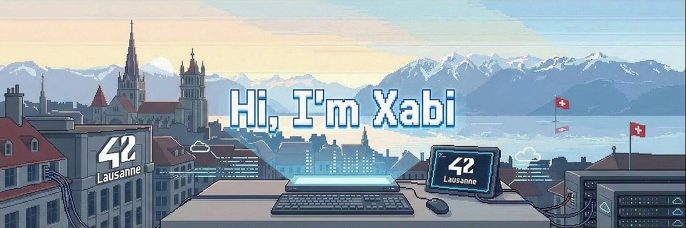

<h1>Hi, I'm Xabi</h1>

<h3>42 Student · Systems Programming · DevOps Infrastructure</h3>

  Spanish developer based in Lausanne, Switzerland. Currently studying at
  <strong>42 Lausanne</strong>, building a strong foundation in
  <strong>C, Unix, Linux, automation, and infrastructure</strong>.

  
  
  

---

<h2>01. About</h2>

  I am a 23-year-old Spanish developer living in Switzerland. My path into software has been shaped by
  adaptability, discipline, and persistence: I moved from a Geography background into the peer-to-peer,
  project-based environment of <strong>42 Lausanne</strong>.

  Before entering tech, I arrived in Switzerland as a farm volunteer, worked operational jobs, and later
  passed the 42 Piscine. Today, I combine systems programming in <strong>C</strong> with real-world
  logistics experience at <strong>Oust!</strong>, where I have seen how infrastructure, automation, and
  reliable processes matter outside the classroom.

  My current direction is <strong>DevOps and infrastructure engineering</strong>: deploying real applications,
  automating environments, understanding Linux deeply, and building projects that are useful, reproducible,
  and maintainable.

---

<h2>02. Current Focus</h2>

<table>
  <tr>
    <td width="50%" valign="top">
      <h3>Currently building</h3>
      <ul>
        <li><strong>42 Core Curriculum:</strong> C, Unix processes, memory management, algorithms.</li>
        <li><strong>Infrastructure:</strong> Odoo ERP deployment architecture.</li>
        <li><strong>DevOps stack:</strong> Terraform, Docker, Traefik, PostgreSQL, Linux.</li>
        <li><strong>Portfolio:</strong> practical projects with clear documentation and reproducible setup.</li>
      </ul>
    </td>
    <td width="50%" valign="top">
      <h3>Interests</h3>
      <ul>
        <li><strong>Engineering:</strong> systems programming, DevOps, automation, infrastructure.</li>
        <li><strong>Context:</strong> history, geography, geopolitics, and how systems evolve.</li>
        <li><strong>Operating style:</strong> direct, practical, resilient, field-oriented.</li>
        <li><strong>Personal note:</strong> I learned to do a handstand from scratch.</li>
      </ul>
    </td>
  </tr>
</table>

---

<h2>03. Technology Stack</h2>

<h3>Core</h3>

  
  
  
  

<h3>Infrastructure & DevOps</h3>

  
  
  
  
  

---

<h2>04. Featured Projects</h2>

<table>
  <thead align="left">
    <tr>
      <th width="24%">Project</th>
      <th width="52%">What it demonstrates</th>
      <th width="24%">Stack</th>
    </tr>
  </thead>
  <tbody>
    <tr>
      <td>
        <a href="https://github.com/Xabieriribar/mela-bike-infrastructure">
          <strong>mela-bike-infra</strong>
        </a>
      </td>
      <td>
        Infrastructure setup for an Odoo deployment, including provisioning, containerized services,
        reverse proxy routing, and deployment-oriented configuration.
      </td>
      <td>Terraform, Docker, Traefik, PostgreSQL, Odoo</td>
    </tr>
    <tr>
      <td>
        <a href="https://github.com/Xabieriribar/minishell">
          <strong>minishell</strong>
        </a>
      </td>
      <td>
        A small Unix shell implementation. Focused on parsing, process creation, pipes, redirections,
        signals, environment variables, and file descriptor management.
      </td>
      <td>C, Unix, Bash</td>
    </tr>
    <tr>
      <td>
        <a href="https://github.com/Xabieriribar/pipex">
          <strong>pipex</strong>
        </a>
      </td>
      <td>
        Recreation of shell pipe behavior using low-level Unix primitives. Handles command execution,
        redirection, process control, and inter-process communication.
      </td>
      <td>C, Unix Processes</td>
    </tr>
    <tr>
      <td>
        <a href="https://github.com/Xabieriribar/push_swap">
          <strong>push_swap</strong>
        </a>
      </td>
      <td>
        Sorting algorithm project using two stacks and a constrained instruction set. Focused on
        algorithmic thinking, operation optimization, and edge-case control.
      </td>
      <td>C, Algorithms</td>
    </tr>
    <tr>
      <td>
        <a href="https://github.com/Xabieriribar/so_long">
          <strong>so_long</strong>
        </a>
      </td>
      <td>
        Small 2D game built with MiniLibX. Covers map parsing, textures, keyboard events,
        rendering loops, and basic game-state management.
      </td>
      <td>C, MiniLibX, Graphics</td>
    </tr>
    <tr>
      <td>
        <a href="https://github.com/Xabieriribar/get_next_line">
          <strong>get_next_line</strong>
        </a>
      </td>
      <td>
        Function that reads from a file descriptor line by line. Focused on static buffers,
        memory allocation, file I/O, and defensive C programming.
      </td>
      <td>C, File I/O, Memory</td>
    </tr>
    <tr>
      <td>
        <a href="https://github.com/Xabieriribar/ft_printf">
          <strong>ft_printf</strong>
        </a>
      </td>
      <td>
        Recreation of the standard <code>printf</code> function. Covers variadic arguments,
        format parsing, type handling, and formatted output.
      </td>
      <td>C, Variadic Functions</td>
    </tr>
    <tr>
      <td>
        <a href="https://github.com/Xabieriribar/libft">
          <strong>libft</strong>
        </a>
      </td>
      <td>
        First custom C library. Reimplementation of core libc-style functions, linked-list utilities,
        string manipulation, and memory operations.
      </td>
      <td>C, Standard Library</td>
    </tr>
  </tbody>
</table>

---

<h2>05. GitHub Metrics</h2>

  
  

  

---

<h2>06. Writing</h2>

  I am currently preparing technical notes and articles on:

<ul>
  <li>C programming and Unix internals</li>
  <li>42 project retrospectives</li>
  <li>Docker, Terraform, Traefik, and deployment architecture</li>
  <li>Infrastructure lessons from real-world automation projects</li>
</ul>

---

<h2>07. Contact</h2>

  I am open to internships, junior systems/DevOps opportunities, infrastructure projects,
  and technical collaboration.

  
  
  

 

  Last updated: 2026 · Xabier Iribar Revuelta

