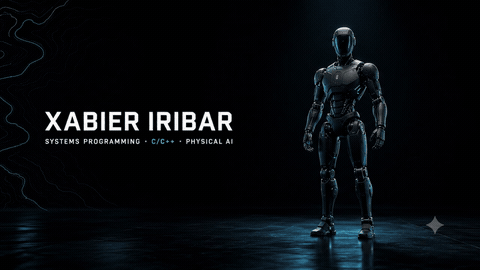

  

  <h1>Xabier Iribar</h1>

  

    <strong>Systems programming · C/C++ · Physical AI</strong> 
    Software engineering student at 42 Lausanne · Vaud, Switzerland
  

  

    
    
    
  

  ▶ Click the animation to watch the full 10-second introduction

 

<table>
  <tr>
    <td width="58%" valign="top">
      <h2>Building at the edge</h2>
      
I build close-to-the-metal software, practical automation and infrastructure that has to behave predictably in the real world.

      
My path started in Geography and Land Planning, working with spatial data, natural hazards and disaster management. At 42 Lausanne, I am turning that systems mindset into C/C++, Unix and networking projects.

    </td>
    <td width="42%" valign="top">
      <h2>Right now</h2>
      <ul>
        <li>Finishing the 42 Lausanne Common Core</li>
        <li>Going deeper into C++98 and object design</li>
        <li>Studying HTTP server architecture</li>
        <li>Moving toward robotics deployment and Physical AI</li>
      </ul>
    </td>
  </tr>
</table>

## Selected work

<table>
  <tr>
    <td width="50%" valign="top">
      <h3><a href="https://github.com/Xabieriribar/cpp-modules">01 · C++ Modules</a></h3>
      
A progression from C++98 fundamentals to inheritance, polymorphism, exceptions, casts, templates and STL algorithms.

      
  

    </td>
    <td width="50%" valign="top">
      <h3><a href="https://github.com/Xabieriribar/minishell">02 · Minishell</a></h3>
      
A Unix shell in C organized as <code>Tokenizer → Expander → Parser → AST → Executor</code>, with pipes, signals and redirections.

      
  

    </td>
  </tr>
  <tr>
    <td width="50%" valign="top">
      <h3><a href="https://github.com/Xabieriribar/automation">03 · Garage Automation</a></h3>
      
FastAPI plus a Chrome extension: visible supplier-cart text becomes reviewable quote and invoice lines with deterministic totals, VAT and exports.

      
  

    </td>
    <td width="50%" valign="top">
      <h3><a href="https://github.com/Xabieriribar/mela-bike-infrastructure">04 · Mela Bike Infrastructure</a></h3>
      
Reproducible Hetzner infrastructure for an Odoo platform, with Terraform, Docker Compose, Traefik, PostgreSQL and encrypted backups.

      
  

    </td>
  </tr>
</table>

  
<strong>More systems work</strong>

   
  <a href="https://github.com/Xabieriribar/push_swap">Push Swap</a> ·
  <a href="https://github.com/Xabieriribar/pipex">Pipex</a> ·
  <a href="https://github.com/Xabieriribar/libft">Libft</a> ·
  <a href="https://github.com/Xabieriribar/ft_printf">ft_printf</a> ·
  <a href="https://github.com/Xabieriribar/get_next_line">get_next_line</a> ·
  <a href="https://github.com/Xabieriribar/webserv-learning">Webserv learning</a>

## Toolbox

  
  
  
  
  
  
  
  
  

## Direction

> I want to build the software layer that lets autonomous machines operate reliably in messy, physical environments — especially where better systems can reduce human exposure to dangerous work.

  <strong>From Unix primitives → reliable services → physical-world systems</strong>

  <a href="https://xabieriribar.com">Portfolio</a> ·
  <a href="https://ch.linkedin.com/in/xabier-iribar-revuelta-b85b09320">LinkedIn</a> ·
  <a href="mailto:xabieriribarrevuelta@gmail.com">Email</a>

